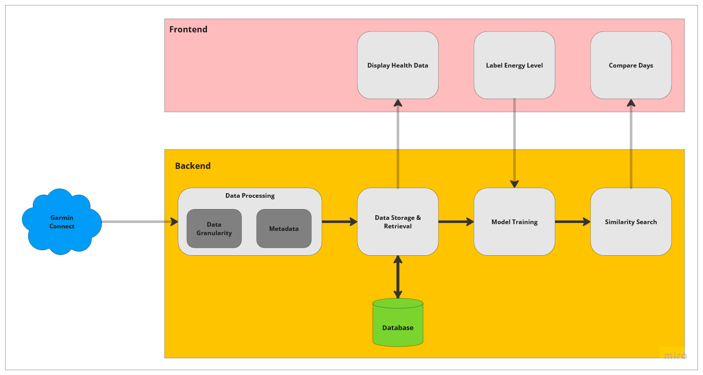
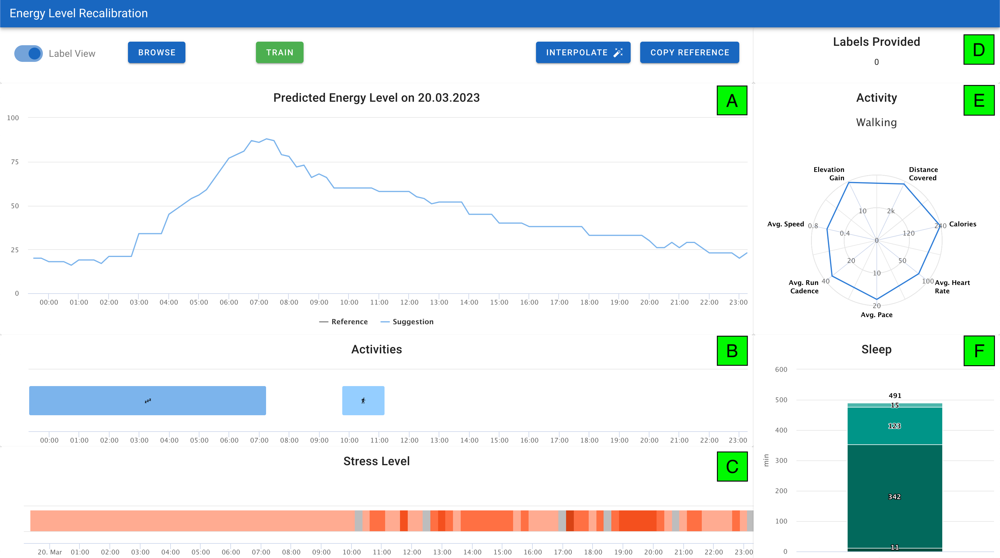
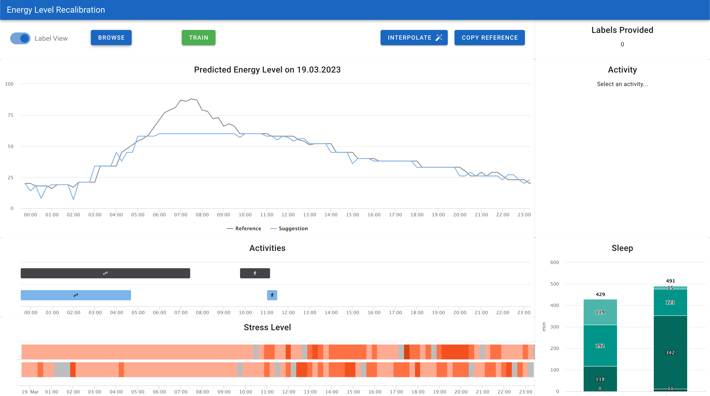
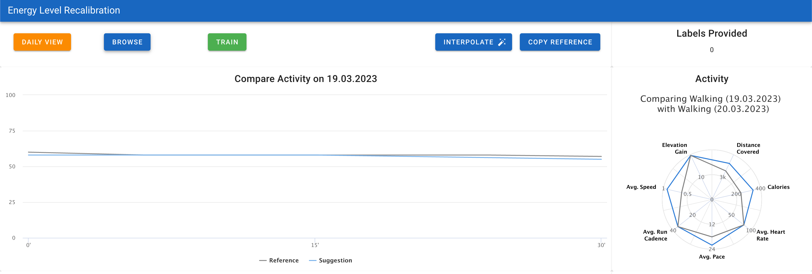
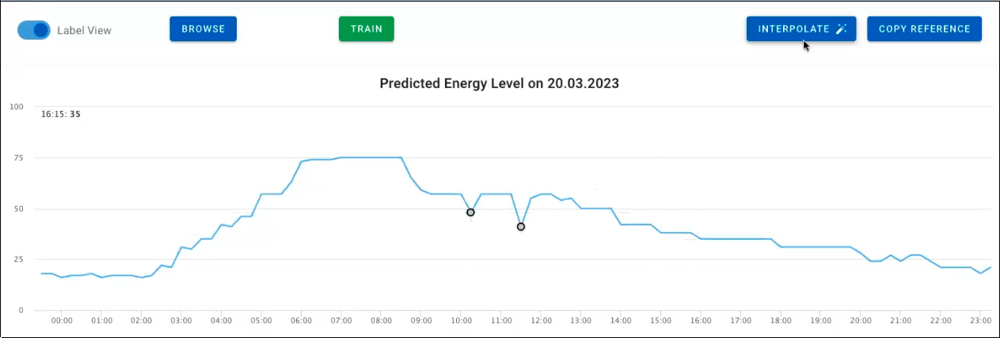
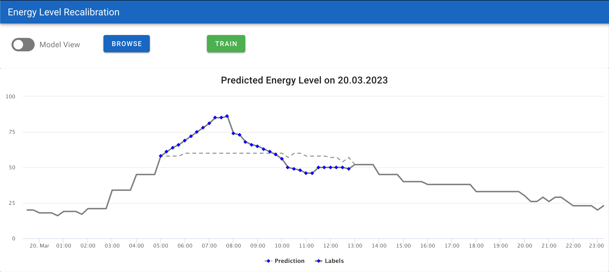

# Energylevel Recalibration

Garmin's Body Battery is often considered as a fun gimmick and rarely do athletes take it into consideration when 
planning their training. One 
This application accesses personal health data
Garmin has a feature known as the Body Battery model, which estimates a person’s energy level based on their 
individual health data. The model takes into account factors such as sleep, stress, and physical activity to provide 
an overall assessment of the wearer’s energy levels. This feature provides interesting insights into a
person’s well-being, however it is often considered as a fun gimmick for the following reasons. First, the model is 
offered *as is* without added explanations for further context to better judge the model. Secondly, the perceived 
energylevel is affected by additional aspects that cannot be measured by metrics such as current mood or mental state.
As such, the user has no influence on the Body Battery model to build trust in it. To overcome this problem, I propose a
visual analytics (VA) tool to give the user direct control over the model to judge the perceived energy level.

## Architecture Overview

The design of the proposed VA tool follows a modular approach, which sees the decomposition  of the software system 
into independent units. Hence, the system responsibility is divided into a backend and frontend part. The following 
Figure illustrates the architecture of the proposed VA tool, including the interaction flow following the data 
synchronization from Garmin up to the presentation in the frontend.



The data is provided through Garmin Health API whenever the user synchronizes his data with their mobile
phone application. Then, the data is sent to the backend for further processing and finally
stored in a MongoDB database. The interface of the VA tool presents interactive charts with which the user
provides direct feedback to the model. Finally, the model is a simple XGBoost model that mimics Garmin's Body Battery
and is continuously retrained with the adjustments (labels) provided by the user.

## User Interface 
Following I demonstrate the features of the VA tool interface



The user interface is comprised of the Label View(A), Activity View (B), Stress View (C), a label progress indicator 
(D), Physical Activity View (E), the Sleep View (F) and a set of user controls at the very top of the interface.

### Single-Day Energy Level Analysis

Upon loading the VA tool, the user gets an overview of the current day’s predicted energy
level. The basic use case of the proposed tool is to facilitate the user to assess the displayed 
prediction and correct them whenever the user’s expectation does not match the model’s outputs.

The Label View (A) enables the user to correct the predictions by dragging the time series
at the desired time of the day. Moreover, a set of controls above the chart allow the user to
compute interpolation between two selected points. Multiple points can be selected while
holding the Shift and clicking on any points in the chart. The drag interaction limits the
dragging space to a value between 0 and 100 and changes the values at a granularity of
1, which facilitates users to make precise adjustments.

To make an informed decision to adjust the daily energy level, the user may consult several
additional charts that contextualize the displayed daily data. As such, the Activity View
(B) gives an overview of daily activities such as sleep and physical activities. It provides a
concise way to visualize the respective duration and shares a common time axis with the
Label View. The exact duration is displayed as a tooltip upon hovering over an activity
and the type of activity is indicated by a symbol at the center of the activity bar.

Daily stress is indicated in the Stress View (C) which again shares the same time axis as
the Label View. It uses a bar chart with bars of same height and users can hover over a
bar to see the exact value. Moreover, the values are color encoded according to Garmin's stress level thresholds

On the top right of the screen, it shows an indicator of the number of provided labels (D).
It is intended to act as a measure of progress for the users.

Users may click on physical activities in the Activity View, which renders a radar chart
in the Physical Activity View (E) with key performance indicators. The exact values are
also displayed upon hovering over the respective axis.

Lastly, the Sleep View (F) indicates the total sleep duration of last night including a break
down of the sleep stages. The user can hover over the bar to view detailed information as
tooltips.

### Cross-Day Energy Level Analysis

The second use case of the VA tool is to compare two different days with respect to their
energy level. By clicking on the Browse button, the user interface searches for a similar
day based on the displayed data and overlays both time series, including all the context
information to show a comparison of each health parameter.



The interface shows both days’ data in all charts which provides a seamless comparison.
The Label View shows the reference series in black color, which is the data of the current
day that serves as a point of reference. The reference series does not allow for any
interactions and is faded out when hovered over any of the two days, to give full focus to
the correction of the suggested series. The suggested series is colored in blue and is thus
consistent with the color scheme of the same-day analysis task. The user may correct
the suggested time series according to the displayed context information. Moreover, if
the user decides that the same adaptions from the reference series apply to the suggested
series, the user may click on the *Copy Reference* button in the control section. In this
case, the suggested series adapts all values of the reference series at an attempt to further
lower the label time.

The Activity View now displays two time series in the same color scheme as the Label
View. The user can click on any two physical activities to zoom into the time frame of the
physical activities. Subsequently, the Physical Activity View and the Label View change.



The Label View is now focused on the two activities. The user may adjust the energy
level of the time frame of the suggested series in much more detail. Moreover, changes
made in this view are immediately applied and hence reflected in the initial Label View
once the user clicks on the Daily View button to get back to the daily overview. Like
in the daily overview, the user may click on the Copy Reference button to take over the
trend of the reference series. If the two activities do not match in duration, the algorithm
uses the time frame of the suggested series.

The selection of two physical activities again triggers a change to the Physical Activity
View, which now shows a comparison of key performance indicator of the two exercises.

Finally, the Model View (Figure 4.6) enables the user to assess the discrepancy between
the model’s predictions and the user’s feedback, which emerged from correcting current
day’s energy level prediction. It serves as main view to assess the goodness of the current
model and thus as motivation for the user. Ideally, the provided labels and the model’s
prediction are in agreement for the majority of the day. Analogously to the main Label
View, the user can browse other days to draw conclusions of the model’s performance
based on the exact time of the day. For example, a user may have observed that the model
succeeds in predicting the energy level at wake-up time. Therefore, the user browses past
days to accept or reject the hypothesis. This concludes the proposed labeling workflow.

Finally, the following pictures show the energy level adjustments through the multiselect interaction and the 
comparison of the new energy level with the previously predicted one




## How to Run

The easiest  way to start the application is through Docker by running the following command

```
docker-compose up -d
```

This will start the frontend, backend, and the MongoDB instance.

Note: The backend requires an env file that sets the access to Garmin's API.

Access the interface at: 

```
http://localhost:3000
```

